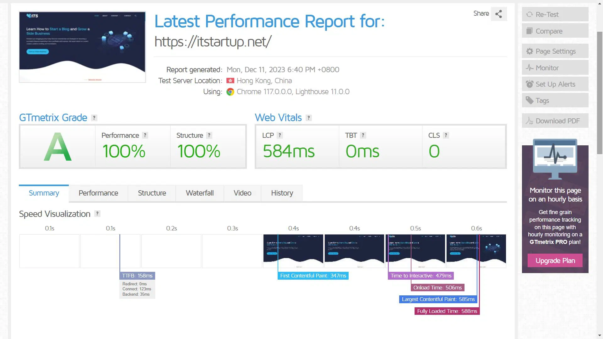
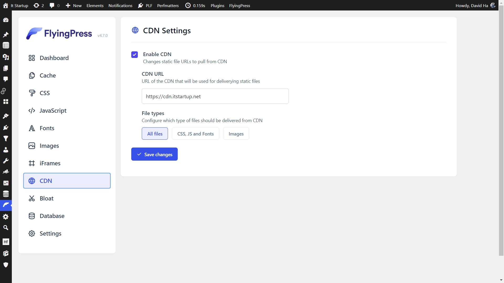
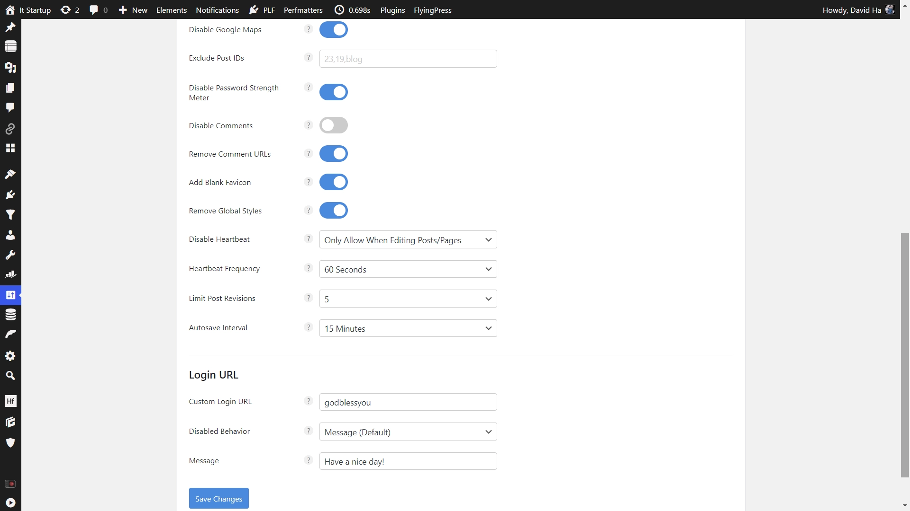

# 网站加速攻略：让加载速度直接影响收益的实战指南

现在这个时代，网站慢一秒，用户就跑了。数据摆在那——加载超过3秒，访客流失率能飙到50%以上。所以优化网站速度不是什么锦上添花的事，而是直接关系到你能不能留住客户、能不能赚到钱的核心问题。

这篇文章就是要告诉你，从服务器选择到插件配置，哪些地方能让网站快起来，哪些坑千万别踩。

---

## 先搞清楚测速工具怎么看

Google PageSpeed 和 GTmetrix，这两个工具你肯定听过。前者是谷歌自家的，后者整合了PageSpeed和YSlow的数据，给的建议更详细。

但你得知道看什么指标。TTFB（首字节时间）、First Paint（首次渲染）、Contentful Paint（有意义内容渲染）——这三个数字直接反映了用户等待的时间。TTFB越短，说明服务器响应越快；后两个越短，用户就能越快看到内容。

个人更推荐GTmetrix，因为它给的数据更专业，建议也更具体。Google PageSpeed有时候太笼统，看完还是不知道该改啥。

## 主机选择是根本

想要好的TTFB？首先得选个靠谱的主机。这事没法省，用便宜货就得承受慢速度。

三个建议：选口碑好的服务商，选离目标用户近的机房，用CDN分发内容。👉 [想要全球覆盖更稳定？试试这个支持多地域部署的云服务方案](https://www.vultr.com/?ref=9738262-9J)。

如果你有多个小网站（比如测试站、卫星站），别都塞在一个主机上。会拖累整体性能。单独买个副主机，把这些小站分开放。Hostinger、HawkHost这些都有便宜套餐，够用了。

### 推荐用Litespeed服务器

Apache、Nginx、Litespeed——这三个web服务器里，Litespeed是性能最强的。它用事件驱动架构，处理并发连接时不会像Apache那样吃资源。

Nginx也不错，但在某些场景下还是比不过Litespeed的优化。Apache？老牌是老牌，但已经有点跟不上时代了。

如果你是新手，建议选带cPanel的主机。cPanel界面友好，拖拖拽拽就能管理网站，不用写代码。建数据库、装应用、配邮箱，点几下就搞定。

### PHP版本别拖后腿

用PHP 8.1。兼容性好，速度比7.4快，WordPress官方推荐。别犹豫，该升就升。

几个重要的PHP配置项：
- max_execution_time: 60
- max_input_time: 60
- max_input_vars: 2000
- memory_limit: 设最大
- post_max_size: 设最大
- upload_max_filesize: 设最大
- zlib.output_compression: 开启

### ModSecurity和Imunify360会拖慢速度

这两个安全工具虽然能保护网站，但确实会增加处理时间。每个请求都要过一遍检查，速度自然上不去。如果不是特别需要，可以考虑关掉或者调低安全等级。

### 必须开启Opcache和Memcached/Redis

Opcache缓存PHP字节码，避免重复编译。Memcached或Redis缓存数据库查询结果，减少数据库压力。这两个一开，速度立马有感觉。

### 能用MariaDB就别用MySQL

MariaDB是MySQL的分支，但优化更好。查询优化器更强，存储引擎选择更多，性能普遍比MySQL好。如果主机支持，换成MariaDB准没错。

### SSD NVMe硬盘是标配

HDD？那是上个时代的东西了。SATA SSD？凑合能用。NVMe SSD？这才是现在该有的配置。

数据访问速度、读写速度、延迟、启动时间——NVMe全方位碾压前两者。想要网站快，硬盘这块不能省。

## WordPress配置开始

### 别碰破解版插件和主题

网上那些null版、crack版，看着免费实际隐患一堆。可能有后门、有恶意代码，还会把你网站安全性拖下水。万一被黑了，损失比买正版大多了。

想省钱可以理解，但这个钱省不得。

### 选个速度快的WordPress主题

GeneratePress、Blocksy、Kadence、Astra——这些主题都是轻量级的，代码优化好，加载快。

如果你想用可视化编辑器，Cwicly和Breakdance都不错，不需要写代码就能搭出好看的页面。会HTML和CSS？那Livecanvas更适合你。

这里就用GeneratePress做示例。它轻量、灵活，速度优化功能强大。

#### GeneratePress的速度优化设置

GenerateBlocks是GeneratePress的配套插件，提供更多可视化模块。两个一起用，搭建页面效率高。

投资PRO版本值得。功能更全，支持优先，更新及时。网站是你赚钱的工具，在这上面投点钱很正常。

在GeneratePress设置里，把Dynamic CSS Print Method改成External File，比inline快。Icon Type选SVG，比Font Icons文件小、加载快。

## 缓存插件是重点

FlyingPress和Swift Performance AI，这两个缓存插件是我推荐的。页面缓存、预加载、CDN集成、图片优化、延迟加载——该有的功能都有。

### FlyingPress的配置

数据库优化这块，用Advanced Database Cleaner单独处理。

### Perfmatters管理JS加载

Perfmatters这个插件能精确控制每个页面加载哪些脚本和样式。不需要的就关掉，减少HTTP请求。

懒加载图片、优化Google Fonts、禁用emoji、去掉query strings——这些小优化加起来效果明显。

Script Manager是Perfmatters的核心功能。你能看到每个页面加载了哪些脚本，然后选择性地开启或关闭。

比如WP-Block-Library这个CSS，如果你不用Gutenberg的默认区块，完全可以禁用它。省下107.5KB的文件大小。

### Advanced Database Cleaner清理数据库

数据库用久了会有很多垃圾数据——修订版本、草稿、孤立记录等等。定期清理能减小数据库体积，提升查询速度。

这个插件轻量，出错概率低。但保险起见，清理前还是备份一下数据。

## BBQ防火墙保护网站安全

Jeff Star开发的BBQ Pro是个不错的防火墙插件。轻量、有效，能拦截SQL注入、XSS攻击、暴力破解等常见威胁。

重点是它不会拖慢速度，对网站性能影响很小。

## 关掉WP Cron，用主机的Cron

WordPress默认的WP Cron会在每次页面加载时检查是否有定时任务要执行。访问量大的时候会增加服务器负担。

解决办法：在wp-config.php里加一行代码禁用WP Cron，然后在主机的cPanel里设置真正的Cron Job。

把domain.com换成你的域名就行。这样定时任务由服务器执行，不占用网站资源。

## 少用Font Awesome和内联SVG

Font Awesome需要加载额外的字体文件，内联SVG会增加HTML文件大小。用多了网页就变臃肿。

能用CSS或SVG sprite替代的就别用Font Awesome。内联SVG也要控制数量，或者改用外部SVG文件。

## Google字体要本地化

每次从Google服务器加载字体会增加请求时间。把字体下载到自己服务器上，只需要加载一次就能缓存。

Perfmatters插件可以自动本地化Google字体。如果用GeneratePress主题，官方有详细教程教你怎么做。

## 图片优化不能省

EWWW Image Optimizer和ShortPixel都是靠谱的图片优化工具。上传时自动压缩，支持WebP格式，能大幅减小图片体积。

图片是网页最占空间的部分，优化好了加载速度立马上去。

## 避免依赖jQuery的插件

jQuery是个好库，但也很重。如果插件必须用jQuery才能运行，就得多加载一个库文件。

现在很多功能用原生JavaScript或者现代框架能实现得更轻量。能不用jQuery就别用。

## 少装插件，定期清理

插件装太多会拖慢网站。每个插件都会增加数据库查询、加载额外脚本。那些自动加载数据多、前端查询频繁的插件尤其要注意。

定期检查插件列表，没用的删掉。没用的图片也删掉，数据库也要定期扫描清理。

## 保持更新

WordPress核心、主题、插件——有更新就装。更新包含安全补丁、bug修复、性能优化。拖着不更新，网站既慢又不安全。

更新前记得备份，万一出问题还能恢复。更新后测试一遍网站功能，确保没问题。

---

说到底，网站速度优化就是个系统工程。主机、服务器配置、主题选择、插件管理、图片优化——每个环节都要抓。做好这些，👉 [配合高性能的云服务器方案](https://www.vultr.com/?ref=9738262-9J)，你的网站速度能甩开竞争对手一大截。用户体验好了，转化率自然就上去了。这不是花钱的事，是赚钱的投资。
